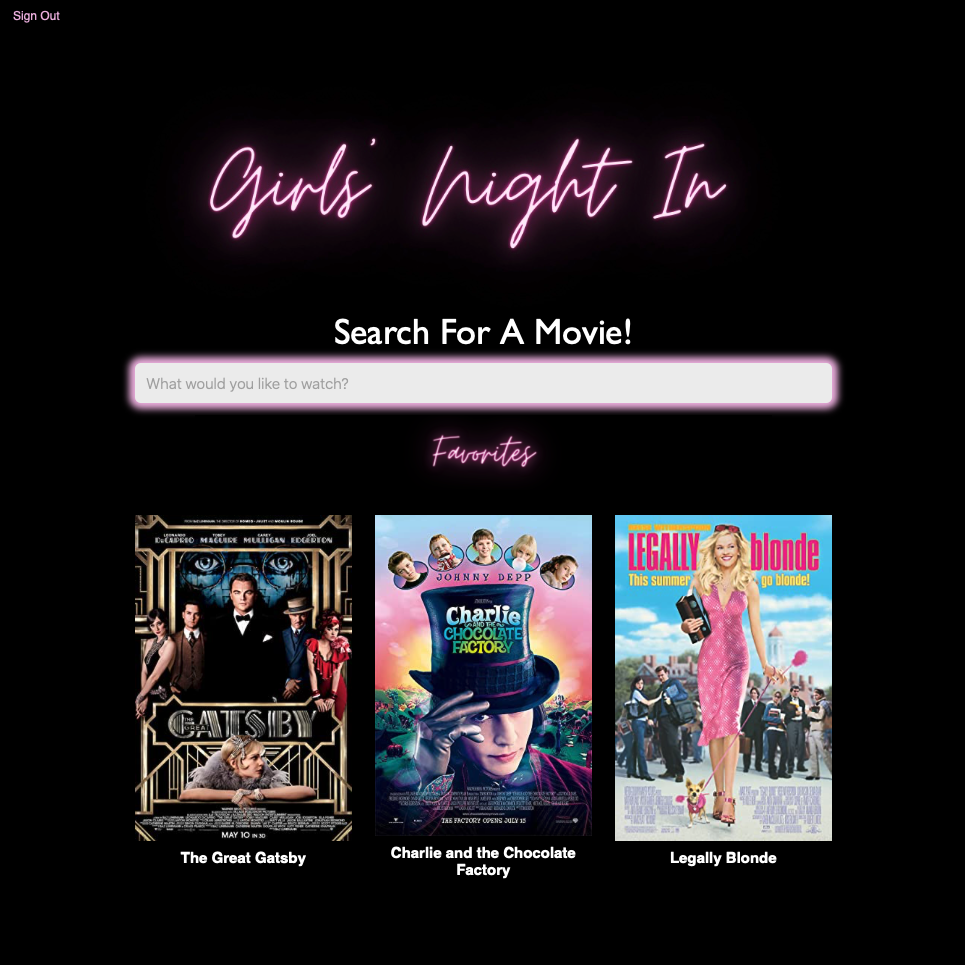
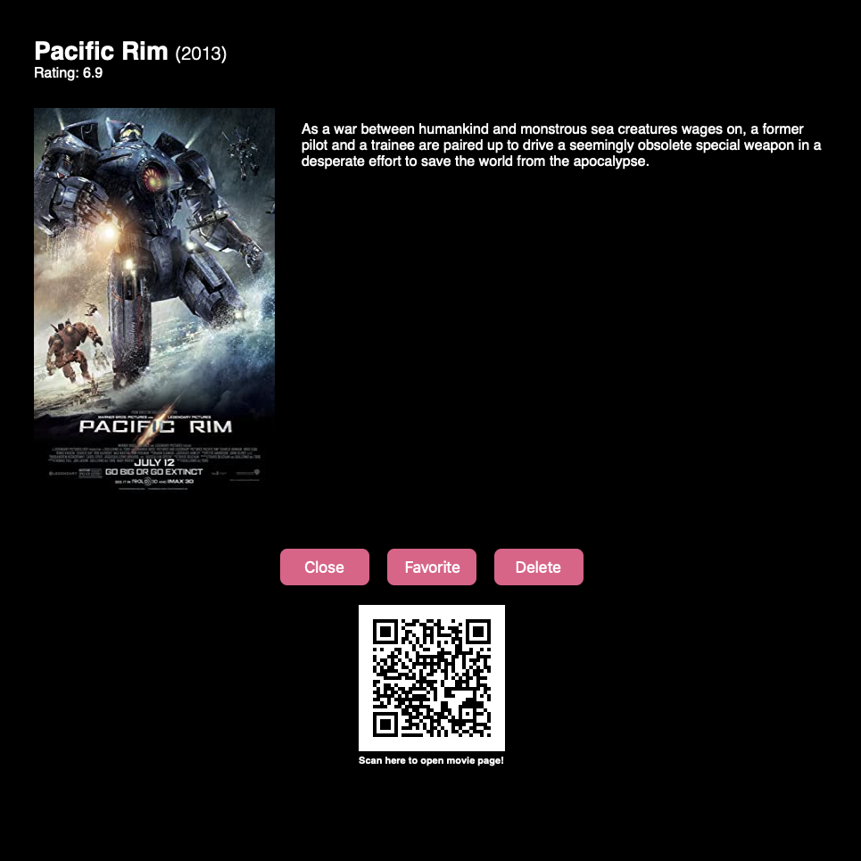

                   <br>

# Girls' Night In Movie App
The Girls' Night In movie app is a fun way to find, save and share movies all in one place!

Forgot the movie your mom’s friend’s sister suggested last Thursday but you remember part of the name? Well now you can search by a full (or partial title) and films associated with your entry will populate. 

Want to share a new found movie with your friends? We got you covered with a custom QR Code!

Secured by Firebase authentication, the Girls' Night In movie app uses a Node and Express Web Server backed by a MongoDB database and Mongoose ODM structured within an MVC Paradigm. With `GET, POST and DELETE` routes, the user can retrieve, add and delete movie data. 

Girls' Night In generates unique QR codes for each movie using `QRCode.React NPM` allowing the user to view more information about a movie on the IMDB website and easily share favorite movies with friends. 

For a personalized experience, the user is required to sign up for access to the Girls' Night In movie app. `Firebase` authentication is used to save user login information, user-specific saved movies and determine user login status.

## Project Links
[Repo Link](https://github.com/onomatopoetica/girls-night-in) <br>
**NOTE:** Since this application cannot be deployed on GitHub, the deployed app can be found on [Heroku](https://girls-night-in.herokuapp.com/). Please see the **Getting Started** section for more information regarding installation, usage, contribution guidelines, tests and where to go for questions.
<br>

## Project Team <br>

#### <a href="https://github.com/onomatopoetica"> [Onomatopoetica](https://github.com/onomatopoetica)
 
#### <a href="https://github.com/Kammielatay"> [Kammielatay](https://github.com/Kammielatay) <br>

#### <a href="https://github.com/MarleeMcinelly"> [MarleeMcinelly](https://github.com/marleemcinelly)
#### <a href="https://github.com/RebeccaChiquete"> [RebeccaChiquete](https://github.com/rebeccachiquete) <br>
<br>
    
## Table of Contents
1. [Project Team](#Project-Team)
1. [About The Project](#About-The-Project)
1. [Project Links](#Project-Links)
1. [Demo](#Demo)
1. [Getting Started](#Getting-Started)
1. [Installation](#Installation)
1. [Usage](#Usage)
1. [Tests](#Tests)
1. [Contribution Guidelines](#Contribution-Guidelines)
1. [Questions](#Questions)
1. [Project Status](#Project-Status)
1. [License](#License)
<br> 

## About The Project

#### Netflix has a cumbersome UI for searching for movie titles from your TV remote. The Girls' Night In app is a fun alternative to searching movie titles on your TV remote. Additionally, you can view in-depth movie information and share movie titles with friends via a QR code!
<br>

When the app launches, the user sees a `Login` page where they can sign into their movie profile or create a new profile by clicking `Sign up Here!`.

* When the user logs into the app, they are taken to the main `Search For A Movie` page where they can search for a movie and view their saved favorite movies. On this main page the user can:
    * Search for movies by title or partial title,
    * View all saved favorite movies,
    * Select a movie poster for more information on a specific movie, or 
    * Have an option to view the movie `QR Code`, `Favorite` or `Delete` a movie,
    * Sign out of the app

* When a user clicks on a movie poster on the main page, they are taken to a popup page with options available for actions specific to the selected movie. The user can:
    * View more information about the movie including:
        * Title, 
        * Release year,
        * IMDB rating,
        * Plot 
    * The user can then:    
        * Scan the QR code to open the associated movie page on IMBD,
        * Favorite the selected movie (saving to their user profile),
        * Delete the selected movie (removing the movie from their user profile),
        * Close the popup page which takes the user back to the search page where their saved favorites are rendered.
  
Because this application cannot be deployed on GitHub, a walkthrough video demonstrates its functionality below. The deployed app can be found on [Heroku](https://girls-night-in.herokuapp.com/).

## Demo

#### The following is an overview of the application in operation and rendering of the Girls' Night In app. 
    
 

#### Below demonstrates how the QR Code works. <br>

 <br>

#### The following are screenshots of the application and overview of its functionality: <br>

 <br>


## Getting Started
    
#### Technologies used in this project include:
* React
* Node
* Express
* Axios NPM
* OMDB API
* IMDB API
* [QRCode.React](https://www.npmjs.com/package/qrcode.react) 
* [React Firebase Authentication](https://react-firebase-js.com/docs/react-firebase-auth/getting-started)
* [MongoDB Atlas](https://www.mongodb.com/)  
* Mongoose 
* Canva
    
#### Installation: 
```  
git clone - https://github.com/onomatopoetica/girls-night-in.git
```
#### Usage 
``` 
See About The Project or demo video above for more information on how it works.
View Project Links above for the link to the deployed app on Heroku.
```
#### Tests
```
After cloning the repo:

Ensure you have [Node.js](https://nodejs.org/en/) installed on your machine.

All NPM packages required for this application are already listed as dependencies in the package.json files. Run the command 'npm i' command in your terminal. Remember to 'npm i' at the root directory level to install root level dependencies and then cd into the client and run 'npm i' for client level dependencies.

The application will be invoked by entering 'npm start' in the command line. 
You will see '🌎 ==> API server now on port 3001!' in the console. You can then view the app on http://localhost:3000/.
```    
#### Contribution Guidelines
```
When contributing to this repository, please contact the project team for review of your contribution plan. 
See contact details below.
```
## Questions 
#### Connect with the project team: <br>

#### [Onomatopoetica](https://github.com/onomatopoetica) <br>
#### [Kammielatay](https://github.com/Kammielatay)<br>
#### [MarleeMcinelly](https://github.com/marleemcinelly) <br>
#### [RebeccaChiquete](https://github.com/rebeccachiquete) <br>
<br>   

<details>
    <summary>Contact</summary>
    jendotb@gmail.com
</details><br> 


## Project Status
<details>
    <summary>Current Project Activity</summary>
    Active
</details>
<br>
    

### _Return to [Table of Contents](#Table-of-Contents)_
<br>

## License
#### Distributed under the MIT License. <br>
<br>

##### This README was generated with :hearts:&nbsp; by [Good README Generator](https://github.com/onomatopoetica/Good-README-Generator).